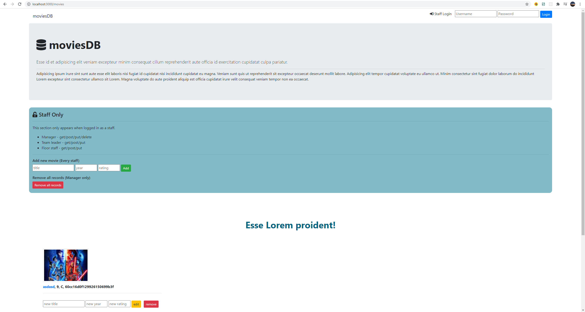

# Description 😍

This is a test project. Simple movies record app which you can add movie name, year, and rating to the database.
Front-end heavily relies on template engine (ejs). I'm still working on user authentication. React⚛ will be applied to the project soon.

## Instructions 👆
In the project directory, you can run:
#### `npm install`
then
#### `npm start`
(You must have mongodb installed and run locally at mongodb://localhost:27017)
 

## Screenshot 🖼

